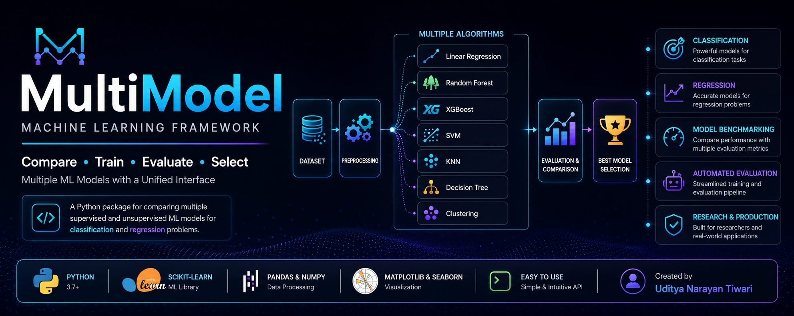

# 🤖 multimodel: A Comprehensive Machine Learning Model Comparison Package

**multimodel** is a Python package designed to **compare multiple supervised and unsupervised machine learning models** for both **classification** and **regression** tasks. It automates model training, evaluation, visualization, and selects the best-performing model based on standard metrics.

---
<p align="center">
  
</p>

---
## 🚀 Key Features

- ✅ Supports **Supervised** and **Unsupervised** learning  
- 🧠 Works for **Classification** and **Regression** problems  
- 📊 Automatically generates **comparison plots** and **evaluation reports**  
- 🏆 Identifies and returns the **best-performing model**  
- 💡 Simple API for fast integration  

---

## 🔍 Supported Models

### 🔷 Supervised Learning

#### Classification
- Logistic Regression  
- Decision Tree Classifier  
- Random Forest Classifier  
- K-Nearest Neighbors  
- Support Vector Machine (SVM)  
- Gradient Boosting Classifier  
- XGBoost Classifier  

#### Regression
- Linear Regression  
- Lasso / Ridge Regression  
- Decision Tree Regressor  
- Random Forest Regressor  
- Gradient Boosting Regressor  
- XGBoost Regressor  

---

### 🔶 Unsupervised Learning

#### Clustering
- KMeans  
- DBSCAN  
- Agglomerative Clustering  

---

## 📦 Installation

```bash
pip install multimodel
````

> *(Coming soon to PyPI)*

---

## 🧪 Usage

### 🔹 Classification Example

```python
from multimodel import MultiModelClassifier

mm = MultiModelClassifier(X, y)
mm.run_all()
mm.get_summary()
mm.plot_comparison()
```

### 🔹 Regression Example

```python
from multimodel import MultiModelRegressor

mm = MultiModelRegressor(X, y)
mm.run_all()
mm.get_summary()
mm.plot_comparison()
```

### 🔹 Clustering Example

```python
from multimodel import MultiModelCluster

mm = MultiModelCluster(X)
mm.run_all()
mm.plot_comparison()
```

---

## 📈 Output Highlights

* 🧾 Accuracy, Precision, Recall, F1-score (for classification)
* 📉 MSE, RMSE, R² score (for regression)
* 📊 Comparison plots, confusion matrices, and error analysis
* 🥇 Automatically highlights the best-performing model

---

## 📚 Dependencies

* `scikit-learn`
* `xgboost`
* `matplotlib`
* `seaborn`
* `pandas`
* `numpy`

Install all dependencies:

```bash
pip install -r requirements.txt
```

---

## 🛠 Roadmap

* [ ] Hyperparameter tuning integration
* [ ] SHAP/feature importance plots
* [ ] Export best model (`.pkl` or `.joblib`)
* [ ] Web-based GUI (using Streamlit)

---

## 🤝 Contributing

Contributions are welcome!
Please check out the [CONTRIBUTING.md](CONTRIBUTING.md) for contribution guidelines.

---

## 📜 License

Licensed under the **MIT License** – see [LICENSE](LICENSE) for details.

---

## 👤 Author

**Uditya Narayan Tiwari**
📍 VIT Bhopal University

🔗 [GitHub](https://github.com/udityamerit)
🔗 [LinkedIn](https://www.linkedin.com/in/uditya-narayan-tiwari-562332289/)
🌐 [Portfolio](https://udityanarayantiwari.netlify.app/)

---
